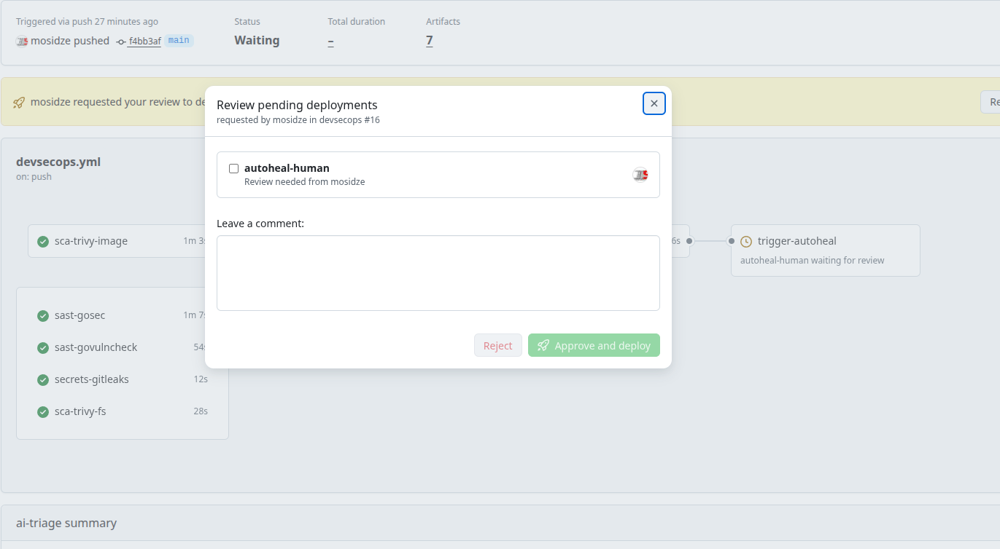

# aiheal

**GitHub-native self-healing CI with AI triage and a human-in-the-loop gate.**

Six scanners find issues. An AI triages them. You click Approve. Another AI proposes the fix and opens a PR. The application code is off-limits — AI only touches `Dockerfile`, `docker-compose.yml`, and `.github/workflows/*`.

The repo ships with a small Go login API as a demo target. Break the Dockerfile, push, and watch the pipeline heal it.

## Why this exists

CI/CD breakage is 80% the same small set of issues — stale base images, missing `USER`, deprecated actions, CVE-ridden packages, broken healthchecks. A one-shot LLM can write the fix, but naive "let AI push to main" pipelines lose on two fronts: prompt injection via runtime logs, and silent privilege escalation inside the workflow file itself.

This repo is the minimum viable architecture for doing it safely:

- **Scope fence** — a structural allow-list restricts AI edits to infrastructure files. Go source, `go.mod`, and `go.sum` are never included in any plan.
- **Prompt injection defence** — runtime logs are sanitized and wrapped in `<untrusted>` tags before they reach the model.
- **Workflow invariants** — AI may not widen `permissions:`, add new secret references, or ship unpinned third-party actions. Violations are rejected before apply, not after.
- **HITL gate** — when AI raises the gate to `block`, the bridge job routes through a GitHub Environment that requires reviewer approval before the heal runs.
- **Memory store** — every heal writes a `(findings, plan, outcome)` record into `artifacts/heal_history/`, tracked inside the PR diff.

## 3-minute demo

1. Fork the repo.
2. In Settings → Secrets and variables → Actions, add the four AI secrets (Groq free tier works):
   - `AI_API_KEY` — any OpenAI-compatible key
   - `AI_PROVIDER` — `openai-compatible`
   - `AI_BASE_URL` — e.g. `https://api.groq.com/openai/v1`
   - `AI_MODEL` — e.g. `llama-3.3-70b-versatile`
3. In Settings → Environments, create two environments:
   - `aiheal-auto` — no protection rules
   - `aiheal-human` — add yourself as Required reviewer
4. Run `make demo-break`, commit the intentionally broken Dockerfile, and push.

### Or: one-shot setup via gh CLI

```bash
# 1. fork + clone
gh repo fork mosidze/aiheal --clone && cd aiheal

# 2. secrets (Groq example — get a free key at console.groq.com)
gh secret set AI_API_KEY   --body "gsk_..."
gh secret set AI_PROVIDER  --body "openai-compatible"
gh secret set AI_BASE_URL  --body "https://api.groq.com/openai/v1"
gh secret set AI_MODEL     --body "llama-3.3-70b-versatile"

# 3. environments (the HITL gate). gh CLI cannot yet set "required reviewers",
#    so open each environment once in the UI and add yourself as reviewer on
#    aiheal-human. aiheal-auto stays unprotected.
gh api -X PUT "repos/:owner/:repo/environments/aiheal-auto"  >/dev/null
gh api -X PUT "repos/:owner/:repo/environments/aiheal-human" >/dev/null
echo "Now open https://github.com/$(gh repo view --json nameWithOwner -q .nameWithOwner)/settings/environments/aiheal-human and tick 'Required reviewers' → yourself."

# 4. trigger the demo
make demo-break
git add Dockerfile && git commit -m "demo: break the Dockerfile" && git push

# 5. watch
gh run watch
```

What you will see, in order:
- `devsecops` workflow runs six scanners. All green.
- `ai-triage` job emits `gate=block` (CVEs in the broken base image).
- `trigger-aiheal` job pauses on the `aiheal-human` environment with a **Review deployments** button.
- You click Approve.
- `aiheal-showcase` workflow opens a PR with a heal: multi-stage build, non-root user, pinned base image, plus an `artifacts/heal_history/<run_id>.json` memory record.



## Architecture

```
                      ┌──────────────────────────────┐
                      │  devsecops workflow          │
                      │  ┌──────┐ ┌──────┐ ┌──────┐  │
                      │  │gosec │ │trivy │ │gitleaks│  │
                      │  └──────┘ └──────┘ └──────┘  │
                      │  ┌──────┐ ┌──────┐ ┌──────┐  │
                      │  │vuln  │ │trivy │ │ ZAP  │  │
                      │  │check │ │image │ │DAST  │  │
                      │  └──────┘ └──────┘ └──────┘  │
                      └──────────────┬───────────────┘
                                     │ 6× SARIF
                                     ▼
                         ┌───────────────────┐
                         │  AI triage        │
                         │  gate=allow|warn  │
                         │       |block      │
                         └─────┬─────────────┘
                               │ docker-scope handoff
                  ┌────────────┴────────────┐
                  │                         │
           gate=allow/warn            gate=block
                  │                         │
                  ▼                         ▼
         ┌─────────────────┐       ┌──────────────────┐
         │ aiheal-auto   │       │ aiheal-human   │
         │ (proceed)       │       │ (Approve → go)   │
         └────────┬────────┘       └────────┬─────────┘
                  │                         │
                  └────────────┬────────────┘
                               ▼
                  ┌───────────────────────┐
                  │ aiheal-showcase     │
                  │ diagnose → plan → fix │
                  │  → validate → verify  │
                  │  → PR + heal_history  │
                  └───────────────────────┘
```

The **AI triage** layer emits a gate and a consolidated docker-scope directive (not 40 raw CVEs — the planner does not need per-vuln detail, it needs "container image has N high-severity findings, bump the base image"). The **aiheal planner** receives that directive plus a deterministic findings payload from the local diagnose step, produces a plan targeting only files inside the allow-list, runs through hadolint / actionlint / `docker compose config` / workflow invariants, applies the change, re-verifies post-heal, and opens a PR.

## What the pipeline *won't* do

This is a feature, not a limitation:

- **Touch Go source.** `*.go`, `go.mod`, `go.sum` are rejected by the plan validator. Business logic is not AI's job.
- **Widen `permissions:` in a workflow.** A structural invariant check compares the new workflow against the old one and rejects any widening (`none → read`, `read → write`, `write-all` anywhere).
- **Add new `${{ secrets.X }}` references.** Same invariant layer.
- **Ship unpinned third-party actions.** Anything not under `actions/*` must be SHA-pinned.
- **Follow instructions found in runtime logs.** All container output passed to the model is wrapped in `<untrusted_runtime_log>` and the system prompt instructs the model to treat it as opaque data.
- **Push straight to `main`.** Heal always lands on a fresh `aiheal/run-<id>` branch via PR. No force-pushes.

## Operator controls

- `AIHEAL_DISABLED=true` as a repo variable disables the heal job globally while leaving diagnose running.
- `AI_*` secrets are scoped only to the `Generate remediation plan` step — the post-heal verify step (which executes AI-generated Dockerfile/compose) runs without them.
- Token usage and per-step latency are recorded in `artifacts/ai_usage.jsonl`.
- Payload budget: AI triage trims to top-40 findings by severity with docker preference. If the payload still overflows, it chunks into 20-item batches. On persistent rate limits, the deterministic scanners still produce a report and the job exits 0 — the AI layer is additive.

## Reviewing an aiheal PR

- [ ] Diff is small and targeted to findings listed in PR body.
- [ ] `hadolint` / `actionlint` / `yamllint` green in the lint-and-test job.
- [ ] No widening of `permissions:` (look at the workflow diff).
- [ ] No new `${{ secrets.* }}` references.
- [ ] Third-party actions pinned by 40-char SHA.
- [ ] Heal history JSON file present under `artifacts/heal_history/`.

## Local dev without an API key

Install Ollama, `ollama pull llama3.1`, copy `.env.example` to `.env`, set `AI_PROVIDER=ollama`, and run the scripts under `scripts/` manually — no `AI_API_KEY` needed. The AI client auto-defaults to `http://localhost:11434/v1`.

## Architecture decisions worth knowing

| Decision | Why |
|---|---|
| AI triage is advisory; eligibility is structural | Groq llama-3.3 triages most base-image CVEs as `needs_human`. The bridge fires on `path_scope=="docker"` regardless. The allow-list downstream is the real gate. |
| Security handoff is consolidated, not per-CVE | 40 individual CVE payloads blow through per-request token budgets. One directive ("bump base image") is what the planner actually needs. |
| HITL on `block`, auto on `allow/warn` | Graduated autonomy — routine fixes proceed, high-risk ones wait for a human click. Implemented via GitHub Environments (native feature, no custom code). |
| Force-push replaced with PR + memory record in diff | Reviewer sees what changed, what findings were addressed, and prior heal outcomes in the same diff. |
| Scanners over mock data | Real Trivy / gosec / govulncheck / gitleaks / ZAP run every push — deterministic signal, AI is layered on top, not substituted for. |

## Stack

- **Scanners** — gosec, govulncheck, gitleaks, Trivy (fs + image), OWASP ZAP baseline.
- **Linters / validators** — hadolint, actionlint, yamllint, `docker compose config`, custom workflow-invariant checker.
- **AI layer** — OpenAI-compatible API (tested with Groq llama-3.3-70b, OpenAI gpt-4o-mini, local Ollama llama3.1). Single-call triage, chunking on overflow.
- **GitHub surface** — Code Scanning (SARIF upload), Environments (HITL gate), PR + labels + memory artifact.

## About the demo app

A minimal Go login API (`register`, `login`, `me`, `users`) with Postgres. Endpoint details in [APP.md](APP.md). The app is a fixed target for the pipeline — its code is intentionally boring.
